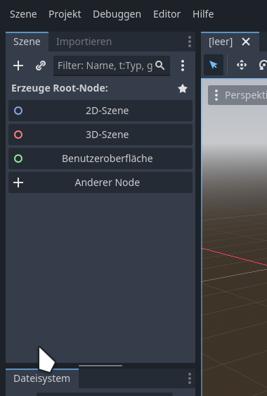

# Start

Wilkommen zum ersten Tutorial für Godot. Heute werden wir einen einfachen Sidescroller Platformer erstellen.

## Einleitung

In diesem Tutorial wirst du Godot kennenlernen. Godot ist eine Open Source Game Engine, welche 2D und 3D Spiele erstellen kann. Godot benutzt eine Eigene Programmiersprache namens "GDscript", welche sich stark an Python orientiert. Als Alternative kann man auch C# benutzen. Dieses Tutorial wird sich jedoch auf GDscript fokussieren.

Zuerst werde ich dir einige hilfreiche Resourcen zeigen, welche du benutzen kannst wenn du Fragen über GDscript oder den Editor hast.

__Hilfe 1: Die Dokumentation__

um diese zu erreichen kannst du im codeeditor einfach auf einen begriff rechtsklicken, und dann im kontextmenü auf die Option "Symbol Nachschlagen" Klicken. Dann sollte sich ein neuer Tab öffnen, wo du hoffentlich eine Antwort auf deine Frage bekommst. Diese Option ist allerdings sehr spezifisch.

Alternativ kannst du auch nach der Dokumentation googlen, da findest du jedoch oft leider nicht dass, wonach du suchst.

__Hilfe 2: Ofizielle Tutorials__

diese kannst du auf der Website der Dokumentation finden (https://docs.godotengine.org/de/4.x/getting_started/step_by_step/index.html). Diese sind garantiert funktional und zeigen viele schwere funktionalitäten besser als irgendwo sonst.

Jetzt fangen wir aber an.

# Neues Projekt erstellen

Wenn du Godot geöffnet hast, siehst du zuerst dieses Fenster.

 __Bild__ 

Nun drückst du auf das Weiße "+"-Symbol woraufhin sich ein neues Menü öffnen sollte. Wähle dort einen Namen und einen Projektpfad deiner Wahl.

 __Bild__ 

Es gibt vor dem Erstellen des projektes einige Einstellungen. 

1. Renderer: Alle Renderer sollten gut funktionieren. Da der Forward+ Renderer die meisten features hat, werde ich ihn für dieses Projekt benutzen. Du kannst ihn notfalls später noch ändern.

2. Metadaten der Versionsverwaltung: Hier gibt es entweder Git oder Nichts, diese Einstellung kann man einfach auf "Git" belassen.

Wenn du noch kein Projekt erstellen kannst musst du einen anderen Ordner wählen, oder links neben dem Projektnamen auf "Ordner Erstellen" Klicken.

Wenn du dass geschafft hast, musst du jetzt nur noch auf Erstellen und Bearbeiten klicken, und du bist bereit für das Tutorial.

## Erste Schritte im Editor

Wenn du den Editor öffnest, sollte das Fenster nun so aussehen. Zuerst werde ich jetzt die einzelnen bereiche des Editors erklären. Wenn du ein Problem mit dem Editor hast, kannst du einfach hierhier zurückkehren.

 1. Node Tree 

Hier werden sich Später alle Objekte im Spiel befinden. Godot nutzt ein Nodesystem, eine Node kann zum beispiel ein Spielercharacter, aber auch ein Bild, 3D objekt, Text und vieles andere sein. Nodes bilden quasi die Basis für den Editor

 2. Dateiexplorer 

Dieser bereich enthält alle "Assets" des Spiels, das enthält z.B. Skripte, Sprites (Bilder), 3D Modelle, Szenen und mehr. Das wirst du noch gut kennenlernen.

 3. Modus-Tabs 

Dort kannst du zwischen 3D, 2D Bearbeitung und zudem in den eingebauten Scripteditor und Assetstore wechseln. Wichtig: Anders als bei Unity gibt es bei Godot _Keine_ eingebauten gemischten 2d und 3d szenen. Wir werden in diesem Tutorial nur die 2D ansicht un den Scripteditor benutzen

 4. Inspektor 

Hier kannst du direkt im Editor attribute von Nodes verändern, so dass du sie nicht über Skripte anpassen musst. Attribute sind zum beispiel die Farbe, die Position, aber auch das Sprite und die Größe einer Node.

Der Inspektor teilt sich standardmäßig einen Bereich mit den Node-Tabs, und dem Bearbeitungsverlauf.

 5. Node-Tab 

Der Node-Tab enthält hauptsächlich Signale. Signale sind in godot ein Weg, um Daten zwischen Nodes auszutauschen. Es gibt eingebaute signale, du kannst aber auch deine eigenen Definieren. Signale werden oft zum beispiel dazu benutzt, um Gegner mitzuteilen dass sie vom Spieler besiegt worden sind, oder um in Menüs beim anklicken eines buttons code auszuführen. Sie sind also ein sehr Wichtiges konzept in Godot.

Der Andere inhalt - "Gruppen" kann für dieses Tutorial gänzlich ignoriert werden. Sie sind dazu da, auszuführung von Code auf mehrere Nodes einfach zu machen, was jedoch oft bessere Alternativen hat.

Der Node-Tab ist in der Rechten oberen Leiste der Zweite tab.

 6. Verlauf-Tab 

Dieser Tab zeigt einen Verlauf kürzlicher Änderungen. Das ist z.B. nützlich, wenn du herausfinden möchtest welche Änderung am Projekt einen Fehler eingebracht hat.

Er Befindet sich in der Rechten Oberen leiste als Dritter Tab.

 7. Untere Tabs 

Diese unteren Tabs enthalten viele nützliche Tools, wie z.B. eine Ausgabeleiste, ein Debugger, sowie tools welche spezifisch zur momentan Ausgewählten Node gehören. Wenn du z.B. ein Animiertes Sprite auswählst, erscheint dort ein Animations tool.

 8. Importieren Tabs 

Diese Einstellungen sind nur in sehr spezifischen Situationen wichtig, zum beispiel um die Qualität von 2D Sprites oder SVGs anzupassen

 

# Assets Importieren

Da niemand ein Tutorial durcharbeiten möchte, dass 2 stunden lang nur Weiße Boxen enthält, werden wir nun zuerst ein paar schöne Sprites importieren.